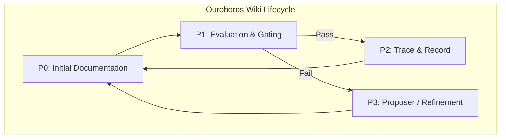

# 60-WikiSkill-Ouroboros

   

## Objective
The objective of the WikiSkill Integration (Ouroboros) MVP is to implement an automated, self-sustaining documentation lifecycle. It ensures that any changes to the system are accurately reflected in the Wiki, evaluated through continuous gating, and iteratively proposed for enhancement, forming a closed "Ouroboros" loop.

> **Incident correction (2026-09-13).** The original MVP committed non-operational,
> simulation-based scaffolding: hardcoded paths, a gating judge that returned a
> fake `1.0` score, three mutually incompatible `.intent.patch` formats, and no
> deterministic initializer. This revision makes the loop genuinely operational and
> fail-closed. See `OUTPUTS/Rapport_Incident_WikiSkill_TeslaWebRaider_2026-09-13.md`.

## Mermaid Graph (Ouroboros Cycle)


## Canonical Runtime Layout (created by `bootstrap_runtime.py`)
```
$TESLA_ROOT/
├── runtime/                                     # runtime state — NEVER committed (gitignore)
│   └── evidence/traces/<skill>/
│       ├── .staging/                            # atomic staging
│       ├── quarantine/                          # rejected traces
│       └── .locks/                              # FS locks
└── .agents/
    └── wiki/<domaine>/                          # wiki layer
        ├── patterns/  broker/  archive/
        ├── index.tsv                            # headers: ID PATTERN_NAME DOMAIN HITS RECENCY REL_PATH
        ├── logs.md
        ├── skill-impact.md
        └── chain_head.sha256                    # hash chain head (tamper-evident)
```

## Scripts & Roles
| Script | Role | Fail-closed |
| :--- | :--- | :--- |
| `bootstrap_runtime.py` | Idempotent initializer of the physical Ouroboros layout | SKIP (never overwrites state) |
| `schemas.py` | Phase A — format, hash, seal (`--seal`) & verify (`--verify`) a trace | exit 1 on invalid/tampered trace |
| `trace_writer.py` | Phase B — atomic write of the sealed trace + optional `--update-chain` | exit 1 on I/O error |
| `skill_proposer.py` | P3 — generates a canonical `.intent.patch` | — |
| `intent_formatter.py` | Validates budget + confinement of a patch | exit 1 on illegal path |
| `patch_broker.py` | Validates patch structure (metadata + unified diff) | exit 1 on malformed patch |
| `sandbox_evaluator.py` | Applies patch in a detached git worktree, runs the judge | exit 1 on git/gating failure |
| `gating_judge.py` | Double-split evaluation over real JSONL datasets | exit 1 if datasets absent (NO simulation) |
| `git_committer.py` | Applies & commits a gated patch | exit 1 if gating rejects |
| `self_test.py` | Deterministic end-to-end validation harness | exit 1 on any FAIL |

## Canonical `.intent.patch` format (unified)
```
<!-- WIKISKILL_METADATA
{
  "skill_target": "tesla-web-raider",
  "justification": "...",
  "parent_hash": "..."
}
-->

diff --git a/.agents/skills/tesla-web-raider/WIKI.md b/.agents/skills/tesla-web-raider/WIKI.md
--- a/.agents/skills/tesla-web-raider/WIKI.md
+++ b/.agents/skills/tesla-web-raider/WIKI.md
@@ ... @@
```
All four consumers (`skill_proposer`, `intent_formatter`, `patch_broker`, `git_committer`)
read this single format. Only the Unified Diff portion is ever passed to `git apply`.

## Usage
```bash
# 1. Initialize the physical layout (idempotent)
python3 scripts/bootstrap_runtime.py --root "$TESLA_ROOT" \
  --skills tesla-web-raider --domains web-osint

# 2. Seal a trace (Phase A)
python3 scripts/schemas.py --seal --input trace.json --out trace.sealed.json

# 3. Verify integrity (Phase A)
python3 scripts/schemas.py --verify --input trace.sealed.json

# 4. Write atomically + chain (Phase B)
python3 scripts/trace_writer.py trace.sealed.json --root "$TESLA_ROOT" --update-chain

# 5. Run the full validation harness
python3 scripts/self_test.py
```
`TESLA_ROOT` defaults to `$HOME/bifrost/tesla` (no hardcoded user paths).

## Governance
**Vigilum Codex 2.0** applies strictly to this MVP. All changes must be traceable, explicitly documented in English, and undergo the designated gating process to ensure documentation remains synchronized with system capabilities. Ratified axiom: **"the agent never generates its own evidence."**
