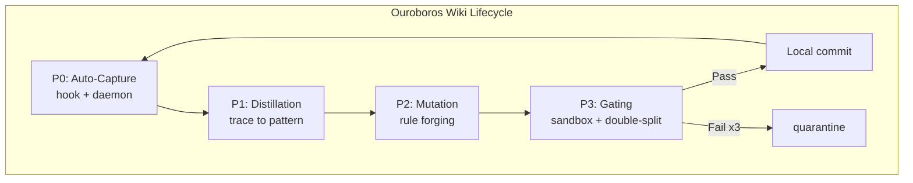

# 60-WikiSkill-Ouroboros

   

## Objective
The objective of the WikiSkill Integration (Ouroboros) MVP is to implement an automated, self-sustaining documentation lifecycle. It ensures that any changes to the system are accurately reflected in the Wiki, evaluated through continuous gating, and iteratively proposed for enhancement, forming a closed "Ouroboros" loop.

## Mermaid Graph (Ouroboros Cycle)


## Zero-Touch Automation (v2)

Phase A no longer depends on the orchestrator remembering to call
`trace_writer.py` (governance-by-incantation, forbidden by Vigilum P4).
Capture is now deterministic machinery:

- **Immediate layer** — `hooks/antigravity/hook_11_ouroboros_capture.sh` drops a
  receipt into `runtime/ouroboros/inbox/` on sub-agent completion. Never blocks.
- **Guaranteed layer** — `scripts/ouroboros_daemon.py` (systemd user service)
  drains the inbox, scans Antigravity transcripts from persistent cursors
  (bounded retroactive backfill on first start), then runs the full cycle.
- **Engine** — `scripts/ouroboros_cycle.py`: verify → distill → forge → gate →
  commit locally. Idempotent, state in `runtime/` (gitignored).

```bash
python3 -m unittest discover -s tests   # 24 tests, stdlib only
./deploy/install.sh --interval 60       # service + hook registration
```

Full contract: [`SKILL.md`](SKILL.md). Creuset assimilation patch:
[`deploy/ASSIMILATION.md`](deploy/ASSIMILATION.md).

## Deliverables
- **WikiSkill Integration**: Core logic to handle wiki content lifecycle.
- **Ouroboros Cycle Implementation**: Nodes P0 to P3, incorporating gating and trace mechanisms.
- **Auto-Capture Layer**: hook + daemon + converter + deterministic rule forging.
- **Scripts Backup**: Archival of the execution scripts within the MVP directory.

## Governance
**Vigilum Codex 2.0** applies strictly to this MVP. All changes must be traceable, explicitly documented in English, and undergo the designated gating process to ensure documentation remains synchronized with system capabilities.
