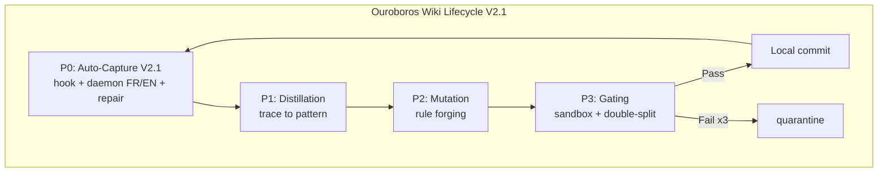

# 60-WikiSkill-Ouroboros — V2.1 Zero-Touch Multilingue

    

## Objective

The objective of the WikiSkill Integration (Ouroboros) MVP is to implement an automated, self-sustaining documentation lifecycle. It ensures that any changes to the system are accurately reflected in the Wiki, evaluated through continuous gating, and iteratively proposed for enhancement, forming a closed "Ouroboros" loop.

**V2.1 FIX** — Diagnostic Ouroboros V2 : le moteur tournait, détectait `tesla-github-manager (77a304c9...)` mais loggait `passe ingestion : 0 trace(s) (inbox=0, scan=0)`. Cause : cécité linguistique (regex `\bSUCCESS\b` anglais strict, agents francophones disant "Mission accomplie avec succès" ignorés). V2.1 corrige avec STATUS_MAP multilingue EN+FR + gouvernance Checkpoint Contract bilingue.

## Mermaid Graph (Ouroboros Cycle V2.1)



## Zero-Touch Automation (v2.1)

Phase A no longer depends on the orchestrator remembering to call
`trace_writer.py` (governance-by-incantation, forbidden by Vigilum P4).
Capture is now deterministic machinery with multilingual support:

- **Immediate layer** — `hooks/antigravity/hook_11_ouroboros_capture.sh` V2.1 drops a
  receipt into `runtime/ouroboros/inbox/` on sub-agent completion. Never blocks.
  Now detects `SUCCES`, `MISSION ACCOMPLIE`, `TERMINE`, `ECHEC`, `ERREUR`, etc. (FR+EN, accent-insensitive).
- **Guaranteed layer** — `scripts/ouroboros_daemon.py` V2.1 (systemd user service)
  drains the inbox, scans Antigravity transcripts from persistent cursors
  (bounded retroactive backfill on first start), detects terminated executions
  (`SUBAGENT_*`/`TOOL_RESULT`/`RESULT`/`RESPONSE`/`DONE`, `[CHECKPOINT CONTRACT]` / `[CONTRAT CHECKPOINT]` / `POINT DE CONTROLE`, explicit FR/EN markers),
  then runs the full cycle. Options `--force-rescan` and `--repair-conv` for repairing FR missions.
- **Engine** — `scripts/ouroboros_cycle.py` V2.1: verify → distill → forge → gate →
  commit locally. Idempotent, state in `runtime/` (gitignored). Now with metrics, timings, `--reset-processed`, `--reprocess-quarantine`.

```bash
python3 -m unittest discover -s tests   # 27 tests V2.1, stdlib only (24 + 3 FR)
python3 scripts/ouroboros_repair_fr.py  # simulation FR 77a304c9
./deploy/install.sh --interval 60       # service + hook registration
```

Full contract: [`SKILL.md`](SKILL.md) V2.1. Creuset assimilation patch:
[`deploy/ASSIMILATION.md`](deploy/ASSIMILATION.md). Governance:
[`GOVERNANCE_CHECKPOINT_CONTRACT.md`](GOVERNANCE_CHECKPOINT_CONTRACT.md).

### Repair FR (diagnostic 77a304c9)

```bash
# Re-scan complet ignorant les curseurs (répare les sessions FR ignorées)
python3 scripts/ouroboros_daemon.py --once --force-rescan --backfill-days 30

# Ne répare qu'une conversation spécifique (ex: tesla-github-manager)
python3 scripts/ouroboros_daemon.py --once --force-rescan --repair-conv 77a304c9

# Replay cycle
python3 scripts/ouroboros_cycle.py --reset-processed
```

## Deliverables V2.1

- **WikiSkill Integration**: Core logic to handle wiki content lifecycle.
- **Ouroboros Cycle Implementation**: Nodes P0 to P3, incorporating gating and trace mechanisms.
- **Auto-Capture Layer V2.1**: hook + daemon + converter + deterministic rule forging, now multilingual EN+FR, accent-insensitive, tolerant is_completion_entry.
- **Observability V2.1**: detailed logs, metrics per skill/outcome, sample types when 0 receipts, force-rescan repair.
- **Governance Checkpoint Contract**: bilingual EN/FR contract `[CHECKPOINT CONTRACT]` / `[CONTRAT CHECKPOINT]` / `POINT DE CONTROLE`.
- **Repair Tool**: `ouroboros_repair_fr.py` for FR blindness.
- **Tests**: 27 tests (24 historical + 3 FR regression for 77a304c9).

## Governance

**Vigilum Codex 2.0** applies strictly to this MVP. All changes must be traceable, explicitly documented, and undergo the designated gating process to ensure documentation remains synchronized with system capabilities.

V2.1 adds **multilingual governance** (Option B) + **infrastructure fix** (Option A) as mandated by the diagnostic:
- Option A: patch `ouroboros_autocapture.py` + hook to include FR triggers (`SUCCÈS`, `ECHEC`, `ACCOMPLIE`, etc.)
- Option B: enforce `[CHECKPOINT CONTRACT]` explicit in fin de mission (now bilingual FR/EN) for standardized collection, but capture remains fail-open (unknown score if no status, never silent drop).

## Audit V2.1

See:
- [`GOVERNANCE_CHECKPOINT_CONTRACT.md`](GOVERNANCE_CHECKPOINT_CONTRACT.md) — detailed diagnostic, fix, deployment checklist
- `scripts/ouroboros_repair_fr.py` — reproduction of the bug and proof of fix
- Tests: `test_french_success_detection`, `test_french_checkpoint_contract`, `test_github_manager_capture`
