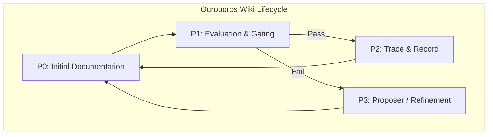

# 60-WikiSkill-Ouroboros

   

## Objective
The objective of the WikiSkill Integration (Ouroboros) MVP is to implement an automated, self-sustaining documentation lifecycle. It ensures that any changes to the system are accurately reflected in the Wiki, evaluated through continuous gating, and iteratively proposed for enhancement, forming a closed "Ouroboros" loop.

## Mermaid Graph (Ouroboros Cycle)

## Deliverables
- **WikiSkill Integration**: Core logic to handle wiki content lifecycle.
- **Ouroboros Cycle Implementation**: Nodes P0 to P3, incorporating gating and trace mechanisms.
- **Scripts Backup**: Archival of the execution scripts within the MVP directory.

## Governance
**Vigilum Codex 2.0** applies strictly to this MVP. All changes must be traceable, explicitly documented in English, and undergo the designated gating process to ensure documentation remains synchronized with system capabilities.
