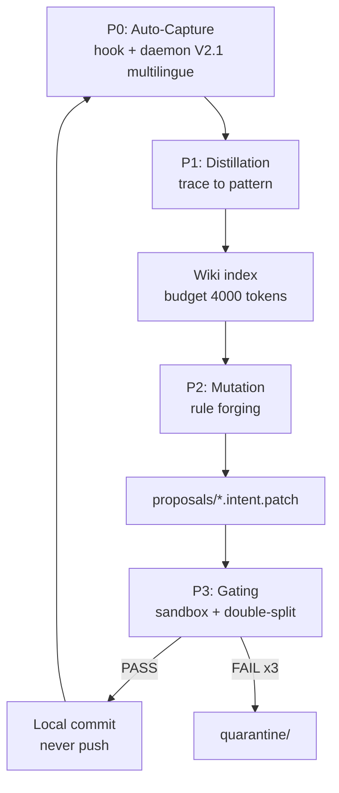

# SKILL — tesla-wiki-manager (Ouroboros)

Self-sustaining documentation lifecycle: every terminated sub-agent execution is
captured as a cryptographically sealed trace, distilled into a bounded wiki,
promoted to a skill-rule proposal after corroboration, and committed only after
isolated deterministic gating. Closed loop, zero orchestrator intervention.

## 1. Architecture (5 phases)



| Phase | Component | Deterministic guarantee |
|---|---|---|
| P0 Capture | `hook_11_ouroboros_capture.sh` (immediate, V2.1 FR+EN) + `ouroboros_daemon.py` (reconciler, V2.1 observability+repair) + `ouroboros_autocapture.py` (converter, V2.1 multilingual) | No LLM. Secrets scrubbed. SHA-256 sealed. AST quarantine. Scores from EXPLICIT markers only (EN+FR, accent-insensitive). |
| P1 Distillation | `distiller.py` | Bounded pattern space (skill x domain x outcome). Rolling observations (max 5). Budget enforced by deterministic eviction, archived never deleted. |
| P2 Mutation | `rule_forger.py` | Only `success` outcomes. HITS >= 3, mean score >= 0.7, no QUARANTINED source, known skill. Justification <= 50 words, rule <= 40 lines. |
| P3 Gating | `sandbox_evaluator.py` + `gating_judge.py` V2 | Detached git worktree. Double-split: structural positive controls + negative controls proving validators bite. |
| Commit | `git_committer.py` | Re-gates, applies diff-only, commits LOCALLY. Push is a sovereign prerogative and is NEVER performed. |

## 2. Why P0 exists (root cause) + V2.1 fix

Phase A historically required the orchestrator LLM to *remember* to invoke
`trace_writer.py` at mission closure. Forgetting it (as observed: 3 missions,
0 traces) is governance-by-incantation, forbidden by Vigilum P4. P0 replaces
the memory duty with deterministic machinery on two layers:

1. **Immediate layer** — `hook_11_ouroboros_capture.sh`: on post-tool payloads
   carrying a sub-agent result, drops a receipt into
   `runtime/ouroboros/inbox/`. Never blocks (`allow`, exit 0, all errors
   swallowed). If the runtime emits pre-tool payloads only, this layer stays
   silent by design.
2. **Guaranteed layer** — `ouroboros_daemon.py` (systemd user service): drains
   the inbox, scans Antigravity transcripts from persistent cursors, detects
   terminated executions (`SUBAGENT_*`/`TOOL_RESULT` types, `[CHECKPOINT
   CONTRACT]` blocks, explicit status markers), ingests them, then runs the
   full cycle. First start performs bounded retroactive backfill
   (`--backfill-days`, default 7).

### V2.0 Diagnostic (cecité linguistique)

Le diagnostic V2 a révélé :

> Le démon Ouroboros tourne parfaitement, a détecté la session `tesla-github-manager (77a304c9...)`
> mais logge `passe ingestion : 0 trace(s) (inbox=0, scan=0)`.

Cause : `STATUS_MAP` ne contenait que `SUCCESS/PARTIAL/FAILURE/FAILED/FAIL/ERROR` en anglais strict
(`\bSUCCESS\b`). Les agents francophones disaient `"Mission accomplie avec succès"`, `"100% Succès"`,
`"Tâche terminée"`, `"Échec critique"` → ignorés silencieusement.

### V2.1 Corrections (Option A + B fusionnées)

**Option A — Infrastructure (fix)** :
- `STATUS_MAP` multilingue EN+FR avec normalisation sans accents (NFD) :
  - SUCCESS : `MISSION ACCOMPLIE`, `100% SUCCES`, `SUCCES`, `SUCCESS`, `REUSSITE`, `REUSSI`, `ACCOMPLIE`, `ACHEVE`, `TERMINE`, `COMPLETE`, `VALIDEE`, `DONE`, etc.
  - PARTIAL : `PARTIEL`, `INCOMPLET`, `PARTIAL`, etc.
  - FAILURE : `ECHEC`, `ERREUR`, `ECHOUE`, `FAILURE`, `ERROR`, `RATE`, etc.
- `is_completion_entry` tolerant :
  - Types contenant `RESULT/RESPONSE/DONE/COMPLETED/FINAL`
  - Checkpoint Contract EN+FR : `[CHECKPOINT CONTRACT]`, `[CONTRAT CHECKPOINT]`, `POINT DE CONTROLE`
  - Si skill connu (`tesla-github-manager` inclus) + texte >80 chars → capture même sans statut (score 0.0 = unknown, jamais d'inférence)
  - Fallback `github/mission/task` substantiel

**Option B — Gouvernance (checkpoint contract)** :
- Tout sous-agent doit rendre en fin de mission :

```markdown
[CHECKPOINT CONTRACT]
contract_type: CHECKPOINT
status: SUCCESS | PARTIAL | FAILURE
task_id: <id>
skill: tesla-github-manager
- step: <action>
final_answer: <résumé>
```

Variantes FR acceptées V2.1 :
- `[CONTRAT CHECKPOINT]` / `type_contrat: CHECKPOINT` / `status: SUCCES`
- `POINT DE CONTROLE - Mission accomplie avec succès`

Le parseur accepte désormais le checkpoint comme preuve primaire mais ne l'exige plus exclusivement (fail-open capture).

**Observabilité V2.1** :
- Logs détaillés : lignes scannées, reçus détectés, répartition `outcomes`, `skills`
- `scan resume: convs=... lignes_totales=... nouvelles=... recus_detectes=... ingestes=... outcomes={} skills={}`
- Si 0 reçus mais lignes présentes : échantillon des types + exemple texte pour diagnostic
- Options réparation : `--force-rescan` (ignore curseurs), `--repair-conv <id>`, `--reset-processed`, `--reprocess-quarantine`

## 3. Receipt format (hook/daemon contract)

```json
{
  "skill": "tesla-web-raider",
  "domaine": "web-osint",
  "task_id": "conv-id#step",
  "model": "antigravity-cli",
  "outcome": "success",
  "score": 1.0,
  "verdict_sources": ["transcript:conv-id:4", "marker:SUCCESS", "kw:MISSION ACCOMPLIE"],
  "steps": [{"index": 0, "type": "checkpoint-evidence", "summary": "..."}],
  "final_answer": "..."
}
```

Only `final_answer`/`steps` free text is accepted; everything is scrubbed.
`outcome`/`score` absent means `unknown`/0.0 — absence of success proof is
scored 0, never inferred.

Multilingual `verdict_sources` examples V2.1 :
- `marker:SUCCESS` (EN) / `marker:SUCCES` (FR) / `marker:MISSION ACCOMPLIE`
- `kw:100% SUCCES` (normalized keyword)
- `hook11:conv:step` / `transcript:conv:step`

## 4. Script inventory (`scripts/`)

| Script | Role | V2.1 |
|---|---|---|
| `schemas.py` | `ExecutionTrace` model, SHA-256 seal, `verify_hash()` | unchanged |
| `secrets_scrubber.py` | Deterministic redaction (idempotent) | unchanged |
| `trace_writer.py` | Atomic trace ingestion, `TESLA_ROOT`-portable | unchanged |
| `ast_quarantine.py` | Python AST dangerous-call screen | unchanged |
| `index_linter.py` | Canonical headers + 4000-token budget guard | unchanged |
| `ouroboros_autocapture.py` | Receipt/transcript to sealed trace converter | **V2.1 multilingual EN+FR, accent-insensitive, tolerant is_completion_entry** |
| `ouroboros_daemon.py` | Watcher + reconciler + cycle driver | **V2.1 observability, force-rescan, repair-conv, brain_root élargi** |
| `ouroboros_cycle.py` | Full A-to-D engine, idempotent, state in `runtime/` | **V2.1 metrics, reset-processed, reprocess-quarantine, timings** |
| `ouroboros_repair_fr.py` | Repair tool for FR blindness (77a304c9) | **NEW V2.1** |
| `distiller.py` | Trace to wiki pattern + budget eviction | unchanged |
| `rule_forger.py` | Deterministic rule proposals | unchanged |
| `intent_formatter.py` | Proposal budget + scope validator | unchanged |
| `patch_broker.py` | Mediation airlock | unchanged |
| `sandbox_evaluator.py` | Detached-worktree evaluation | unchanged |
| `gating_judge.py` | V2 real double-split gate | unchanged |
| `git_committer.py` | Gate-then-commit-local | unchanged |
| `locker.py` | Non-blocking exclusive file lock | unchanged |
| `skill_proposer.py` | LEGACY simulator, kept for reference | unchanged |

## 5. Canonical `.intent.patch` format

~~~
```json
{"skill_target": "...", "justification": "<=50 words", "parent_hash": "<sha16|genesis>"}
```
diff --git a/.agents/skills/<target>/WIKI.md b/.agents/skills/<target>/WIKI.md
--- a/.agents/skills/<target>/WIKI.md
+++ b/.agents/skills/<target>/WIKI.md
@@ ...
~~~

This single format passes `intent_formatter.py`, `patch_broker.py` and
`git apply` (the three historical formats were mutually exclusive — fixed).

## 6. Deployment

```bash
cd 60-WikiSkill-Ouroboros
python3 -m unittest discover -s tests            # 27 tests V2.1, stdlib only
python3 scripts/ouroboros_repair_fr.py           # simulation FR 77a304c9
./deploy/install.sh --interval 60                # systemd user service + hook
journalctl --user -u ouroboros-capture -f        # watch first backfill
```

One-shot operations (no service):

```bash
python3 scripts/ouroboros_daemon.py --once --backfill-days 7   # ingest + cycle
python3 scripts/ouroboros_daemon.py --once --force-rescan --backfill-days 30  # repair FR
python3 scripts/ouroboros_daemon.py --once --force-rescan --repair-conv 77a304c9
python3 scripts/ouroboros_cycle.py --no-commit                 # distill + forge only
python3 scripts/ouroboros_cycle.py --reset-processed --reprocess-quarantine  # full replay
python3 scripts/ouroboros_autocapture.py --receipt receipt.json
python3 scripts/ouroboros_repair_fr.py --real --backfill-days 30
```

## 7. Doctrine compliance (Vigilum Codex 2.0)

- **LLM-as-a-judge formally banned**: scoring, distillation, forging and gating
  are pure deterministic code (stdlib only, zero network, zero model call).
- **Cryptographic integrity**: trace filename = SHA-256(content); internal
  `sha256` field re-verified at every cycle; mismatch = quarantine.
- **Semantic-bloat control**: index hard-capped at ~4000 tokens per domain;
  eviction is deterministic (HITS x recency-decay), archived under
  `.agents/wiki/_archive/` (P8: no silent deletion).
- **Fail-closed integrity, fail-open capture**: a broken capture never breaks
  a mission; a broken proof never becomes a rule (3 gate failures = quarantine).
- **Sovereignty**: local commits only after PASS; push is never performed by
  the machinery (AGENTS.md execution contract).
- **Zero-Touch Ops**: background persistence via systemd user unit (GEMINI.md R8),
  never a manual terminal watch.
- **Multilingual governance V2.1**: EN+FR markers with accent-insensitive normalization,
  checkpoint contract bilingual, no silent drop for known skills.

## 8. Creuset assimilation (rule 18) + Repair

This mirror ships `deploy/ASSIMILATION.md`: the exact `settings.json`
whitelist patch to apply in the Creuset (`$TESLA_ROOT`) so the daemon scripts
execute friction-free. No new delegation row (auto-capture is infrastructure,
not a routable capability) and no manifest change.

**Repair FR (77a304c9) assimilation** :

```bash
# 1. Sync V2.1 scripts
diff -q 60-WikiSkill-Ouroboros/scripts/ouroboros_autocapture.py \
  .agents/skills/tesla-wiki-manager/scripts/ouroboros_autocapture.py && echo "SYNC OK"

# 2. Force-rescan rétroactif (capture les missions FR ignorées)
TESLA_ROOT="$TESLA_ROOT" python3 .agents/skills/tesla-wiki-manager/scripts/ouroboros_daemon.py --once --force-rescan --backfill-days 30

# 3. Vérif
ls .agents/traces/*.json | wc -l
grep -i "github-manager" .agents/traces/*.json | wc -l
cat runtime/ouroboros/daemon.log | tail -n 100

# 4. Cycle replay
python3 .agents/skills/tesla-wiki-manager/scripts/ouroboros_cycle.py --reset-processed
```

Full V2.1 audit: [`GOVERNANCE_CHECKPOINT_CONTRACT.md`](GOVERNANCE_CHECKPOINT_CONTRACT.md) + [`AUDIT_OUROBOROS_V2.1.md`](AUDIT_OUROBOROS_V2.1.md) (if present).
