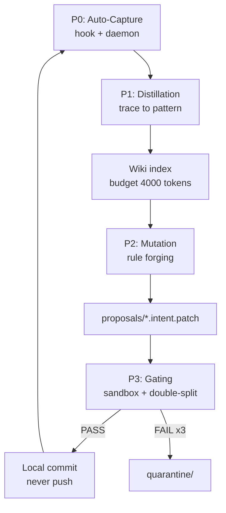

# SKILL — tesla-wiki-manager (Ouroboros)

Self-sustaining documentation lifecycle: every terminated sub-agent execution is
captured as a cryptographically sealed trace, distilled into a bounded wiki,
promoted to a skill-rule proposal after corroboration, and committed only after
isolated deterministic gating. Closed loop, zero orchestrator intervention.

## 1. Architecture (5 phases)



| Phase | Component | Deterministic guarantee |
|---|---|---|
| P0 Capture | `hook_11_ouroboros_capture.sh` (immediate) + `ouroboros_daemon.py` (reconciler) + `ouroboros_autocapture.py` (converter) | No LLM. Secrets scrubbed. SHA-256 sealed. AST quarantine. Scores from EXPLICIT markers only. |
| P1 Distillation | `distiller.py` | Bounded pattern space (skill x domain x outcome). Rolling observations (max 5). Budget enforced by deterministic eviction, archived never deleted. |
| P2 Mutation | `rule_forger.py` | Only `success` outcomes. HITS >= 3, mean score >= 0.7, no QUARANTINED source, known skill. Justification <= 50 words, rule <= 40 lines. |
| P3 Gating | `sandbox_evaluator.py` + `gating_judge.py` V2 | Detached git worktree. Double-split: structural positive controls + negative controls proving validators bite. |
| Commit | `git_committer.py` | Re-gates, applies diff-only, commits LOCALLY. Push is a sovereign prerogative and is NEVER performed. |

## 2. Why P0 exists (root cause)

Phase A historically required the orchestrator LLM to *remember* to invoke
`trace_writer.py` at mission closure. Forgetting it (as observed: 3 missions,
0 traces) is governance-by-incantation, forbidden by Vigilum P4. P0 replaces
the memory duty with deterministic machinery on two layers:

1. **Immediate layer** — `hook_11_ouroboros_capture.sh`: on post-tool payloads
   carrying a sub-agent result, drops a receipt into
   `runtime/ouroboros/inbox/`. Never blocks (`allow`, exit 0, all errors
   swallowed). If the runtime emits pre-tool payloads only, this layer stays
   silent by design.
2. **Guaranteed layer** — `ouroboros_daemon.py` (systemd user service): drains
   the inbox, scans Antigravity transcripts from persistent cursors, detects
   terminated executions (`SUBAGENT_*`/`TOOL_RESULT` types, `[CHECKPOINT
   CONTRACT]` blocks, explicit status markers), ingests them, then runs the
   full cycle. First start performs bounded retroactive backfill
   (`--backfill-days`, default 7).

## 3. Receipt format (hook/daemon contract)

```json
{
  "skill": "tesla-web-raider",
  "domaine": "web-osint",
  "task_id": "conv-id#step",
  "model": "antigravity-cli",
  "outcome": "success",
  "score": 1.0,
  "verdict_sources": ["transcript:conv-id:4", "marker:SUCCESS"],
  "steps": [{"index": 0, "type": "checkpoint-evidence", "summary": "..."}],
  "final_answer": "..."
}
```

Only `final_answer`/`steps` free text is accepted; everything is scrubbed.
`outcome`/`score` absent means `unknown`/0.0 — absence of success proof is
scored 0, never inferred.

## 4. Script inventory (`scripts/`)

| Script | Role |
|---|---|
| `schemas.py` | `ExecutionTrace` model, SHA-256 seal, `verify_hash()` |
| `secrets_scrubber.py` | Deterministic redaction (idempotent) |
| `trace_writer.py` | Atomic trace ingestion, `TESLA_ROOT`-portable (hardcoded path fixed) |
| `ast_quarantine.py` | Python AST dangerous-call screen |
| `index_linter.py` | Canonical headers + 4000-token budget guard |
| `ouroboros_autocapture.py` | Receipt/transcript to sealed trace converter |
| `ouroboros_daemon.py` | Watcher + reconciler + cycle driver |
| `ouroboros_cycle.py` | Full A-to-D engine, idempotent, state in `runtime/` |
| `distiller.py` | Trace to wiki pattern + budget eviction |
| `rule_forger.py` | Deterministic rule proposals (replaces simulated `skill_proposer.py`) |
| `intent_formatter.py` | Proposal budget + scope validator |
| `patch_broker.py` | Mediation airlock (accepts canonical fenced JSON) |
| `sandbox_evaluator.py` | Detached-worktree evaluation (diff-only apply fixed) |
| `gating_judge.py` | V2 real double-split gate (simulated 1.0 stub replaced) |
| `git_committer.py` | Gate-then-commit-local (canonical metadata + diff-only apply fixed) |
| `locker.py` | Non-blocking exclusive file lock primitive |
| `skill_proposer.py` | LEGACY simulator, kept for reference, not used by the cycle |

## 5. Canonical `.intent.patch` format

~~~
```json
{"skill_target": "...", "justification": "<=50 words", "parent_hash": "<sha16|genesis>"}
```
diff --git a/.agents/skills/<target>/WIKI.md b/.agents/skills/<target>/WIKI.md
--- a/.agents/skills/<target>/WIKI.md
+++ b/.agents/skills/<target>/WIKI.md
@@ ...
~~~

This single format passes `intent_formatter.py`, `patch_broker.py` and
`git apply` (the three historical formats were mutually exclusive — fixed).

## 6. Deployment

```bash
cd 60-WikiSkill-Ouroboros
python3 -m unittest discover -s tests            # 24 tests, stdlib only
./deploy/install.sh --interval 60                # systemd user service + hook
journalctl --user -u ouroboros-capture -f        # watch first backfill
```

One-shot operations (no service):

```bash
python3 scripts/ouroboros_daemon.py --once --backfill-days 7   # ingest + cycle
python3 scripts/ouroboros_cycle.py --no-commit                 # distill + forge only
python3 scripts/ouroboros_autocapture.py --receipt receipt.json
```

## 7. Doctrine compliance (Vigilum Codex 2.0)

- **LLM-as-a-judge formally banned**: scoring, distillation, forging and gating
  are pure deterministic code (stdlib only, zero network, zero model call).
- **Cryptographic integrity**: trace filename = SHA-256(content); internal
  `sha256` field re-verified at every cycle; mismatch = quarantine.
- **Semantic-bloat control**: index hard-capped at ~4000 tokens per domain;
  eviction is deterministic (HITS x recency-decay), archived under
  `.agents/wiki/_archive/` (P8: no silent deletion).
- **Fail-closed integrity, fail-open capture**: a broken capture never breaks
  a mission; a broken proof never becomes a rule (3 gate failures = quarantine).
- **Sovereignty**: local commits only after PASS; push is never performed by
  the machinery (AGENTS.md execution contract).
- **Zero-Touch Ops**: background persistence via systemd user unit (GEMINI.md R8),
  never a manual terminal watch.

## 8. Creuset assimilation (rule 18)

This mirror ships `deploy/ASSIMILATION.md`: the exact `settings.json`
whitelist patch to apply in the Creuset (`$TESLA_ROOT`) so the daemon scripts
execute friction-free. No new delegation row (auto-capture is infrastructure,
not a routable capability) and no manifest change.
