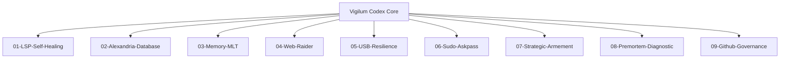

# Ops Consultant — AI Agents, CLI Workflows & Local Governance
*Author:* Lord Mahonheim  
*Status:* Verified Reference (statut/valide)  
*Tagline:* "An un-governed agent is a liability; structure is the mother of security."

## Tested Environment Table
| Parameter | Value |
| :--- | :--- |
| Date | 2026-06-28 |
| Host Machine | MIDGARD |
| Operating System | Linux (Ubuntu/Debian) |
| Workspace Path | `/home/lord-mahonheim/bifrost/tesla` |
| Python Version | 3.10+ |
| Node.js Version | 18+ |
| SQLite Version | 3.37+ |

## Important Security Notice
This repository contains anonymized configuration models and utility wrappers. No active passwords, private Obsidian vaults, local database files (`*.db`, `.chroma_vectors`), or API tokens are tracked.

## Table of Contents
1. Executive Summary
2. Problem Statement
3. Product Promise
4. Core Principles Table
5. Architecture Diagram
6. Repository Layout
7. Workflow Sequence
8. Technical Stack
9. Security and Governance Rules
10. Acceptance Criteria
11. Final Verdict & Signature Sentence

## Executive Summary
Vigilum Codex is an institution-matrice dedicated to human performance, strategic intelligence, and governed local AI operations. The projects hosted within this repository form the technical infrastructure of the Tesla agent, operating locally on MIDGARD.
This repository acts as a public MVP release of the core workflow automation and governance modules. It integrates 9 subprojects ranging from static code syntax healing to secure graphical authentication wrappers and hybrid search engines.

## Problem Statement
In previous iterations, the AI agent functioned without clear local boundaries. This resulted in multiple system level errors:
1. **Broken local paths:** Hardcoded paths (`/home/lord-mahonheim/bifrost/tesla`) rendered scripts non-portable.
2. **Context Saturation:** Linear directory sweeps overloaded the model's token cache, leading to high latency and search failures.
3. **Authentication blocks:** Background commands froze due to missing TTY prompts, and git operations were rejected due to unbound SSH key permissions.
4. **Isolated tools:** Scripts were built in isolation without common imports, causing naming collisions and dependency breakage.

## Product Promise
* **What it does:** Scaffolds a complete, documented set of local agent modules, verifying syntactic correctness, cognitive persistence, and secure execution.
* **What it does NOT do:** Route telemetry to external servers, allow direct remote branch pushing without checks, or bypass manual approvals.

## Core Principles Table
| Principle | Meaning | Impact |
| :--- | :--- | :--- |
| Local Execution | All processes run on host MIDGARD. | Guarantees complete data sovereignty. |
| Verification First | Run LSP and syntax tests before commit. | Guarantees codebase structural integrity. |
| Explicit Approval | Root modifications require operator dialog. | Retains human authority over system changes. |

## Architecture Diagram


## Repository Layout
```text
MVP-GITHUB/
├── .gitignore
├── CODE_OF_CONDUCT.md
├── CONTRIBUTING.md
├── LICENSE
├── MY_COMPANY.md
├── README.md
├── SECURITY.md
├── SUPPORT.md
├── 01-LSP-Self-Healing/
├── 02-Alexandria-Database/
├── 03-Memory-MLT/
├── 04-Web-Raider/
├── 05-USB-Resilience/
├── 06-Sudo-Askpass/
├── 07-Strategic-Armement/
├── 08-Premortem-Diagnostic/
└── 09-Github-Governance/
```

## Workflow Sequence
1. The developer triggers updates within a project folder.
2. Code edits are checked by `01-LSP-Self-Healing` via local pyright diagnostics.
3. Successful revisions are documented and indexed using the `02-Alexandria-Database` hybrid indexer.
4. Action logs are consolidated into the `03-Memory-MLT` long-term persistence layer.
5. All system or push actions must abide by the rules configured in `09-Github-Governance`.

## Technical Stack
* **Languages:** Python 3.10+, Bash (Shell)
* **Frameworks:** Playwright, Sentence-Transformers
* **Storage:** SQLite FTS5, ChromaDB (local)
* **Testing:** Pyright LSP

## Security and Governance Rules
* Isolation: Tools must run within the designated user privileges.
* Zero Network Autonomy: The agent cannot add remotes, commit keys, or push code without explicit manual authorization.
* Backup Protocol: Commits must always be preceded by local git status checks to exclude caches and databases.

## Acceptance Criteria
* All 9 subprojects exist and are fully populated.
* Pyright reports 0 errors across all Python files.
* Local repository branch versioning is initialized on `feature/scaffolding-mvp`.

## Final Verdict & Signature Sentence
**VERDICT: OPERATIONAL SYSTEM STABILIZED**  
*"Precision in structure brings governance in execution."*
